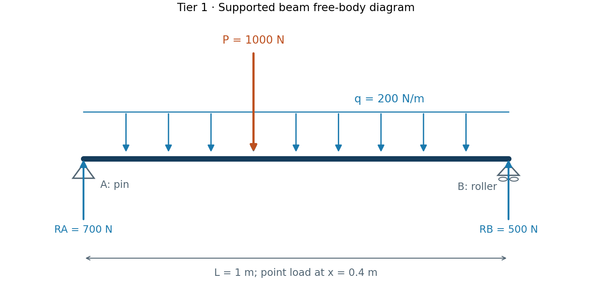
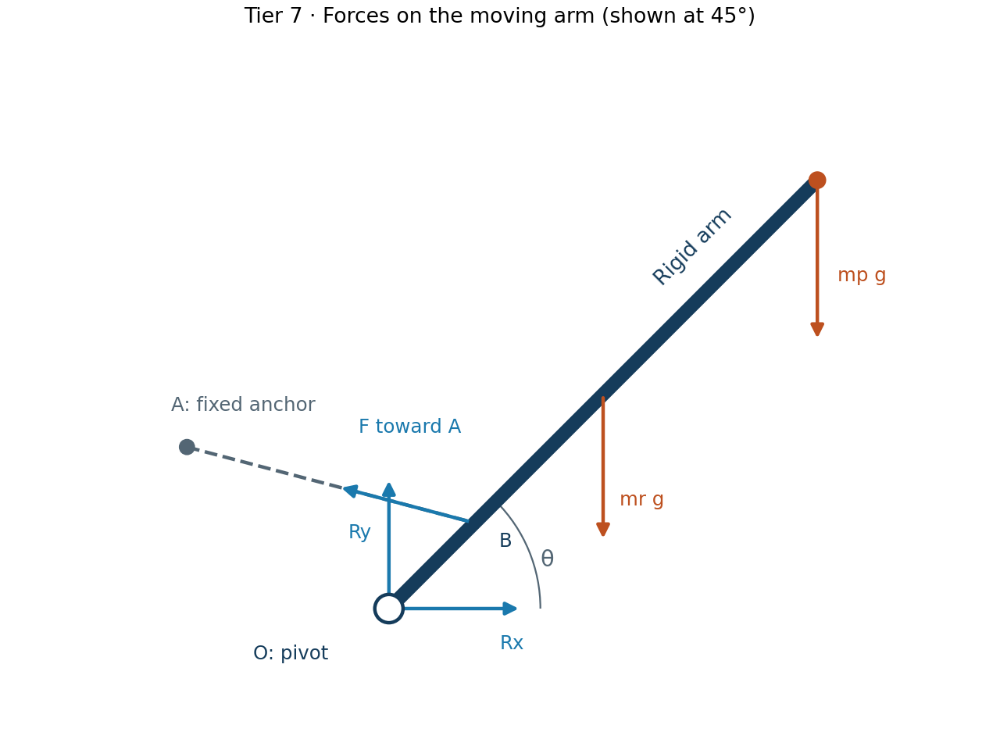

# Free-body diagrams

Before using an equation, identify one body or one chosen system boundary.

1. Isolate that body from everything touching it.
2. Replace supports/connections with the forces and moments they can transmit.
3. Add weight and applied loads at their locations.
4. Mark coordinates, dimensions, and the reference point for moments.
5. In dynamics, write the body's actual acceleration separately. This repo uses
   external force = mass times acceleration, rather than adding an extra inertia
   force to the physical force diagram.

| Ideal connection | Planar reaction model |
|---|---|
| Frictionless pin | Two force components; no reaction couple |
| Roller on a horizontal surface | Vertical reaction; unilateral contact cannot pull |
| Fixed support | Two force components plus a reaction moment |
| Massless cable | Tension along the cable; cannot push |
| Ideal two-force member | Opposite collinear end forces |
| Rigid frame joint | May transmit axial force, shear, and moment |

## Beam example

Tier 1 uses upward reaction arrows and downward applied loads. An assumed
reaction direction is a sign convention; a negative result reverses it.

## Actuated-arm geometry

The pivot reaction and actuator force act on the moving arm. The stationary
mount receives their opposites. The diagram shows assumed positive directions;
arrow lengths are illustrative and are not force magnitudes.

Regenerate these baseline diagrams with `python3 scripts/draw_diagrams.py`
after installing the optional plotting dependency. Their arrows illustrate the
model assumptions; diagram inputs are fixed in that script.
