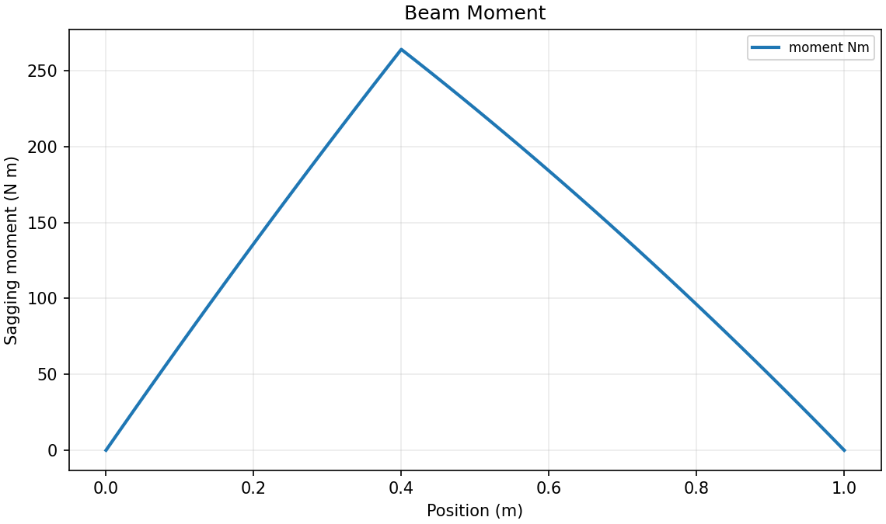
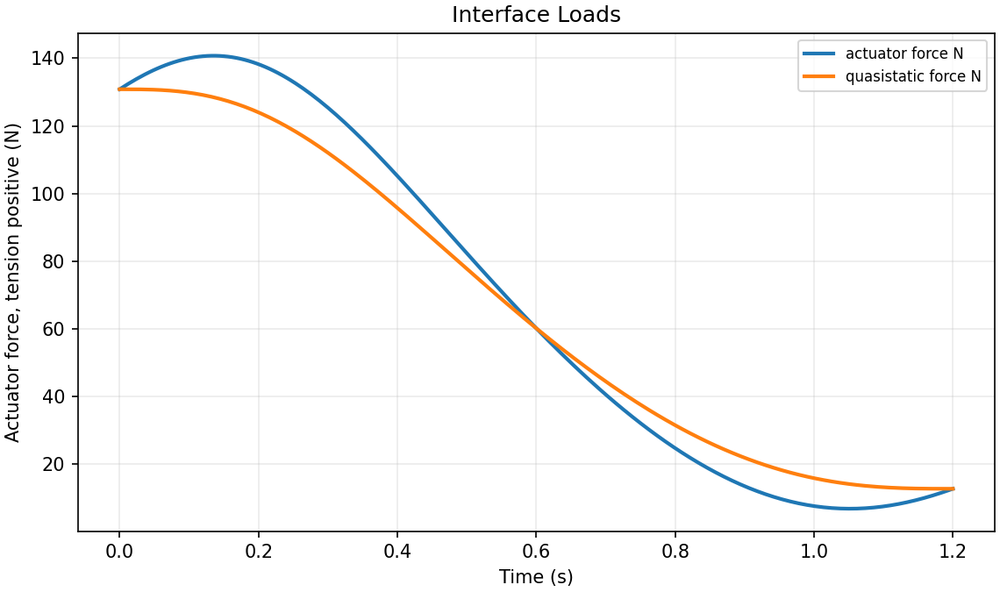
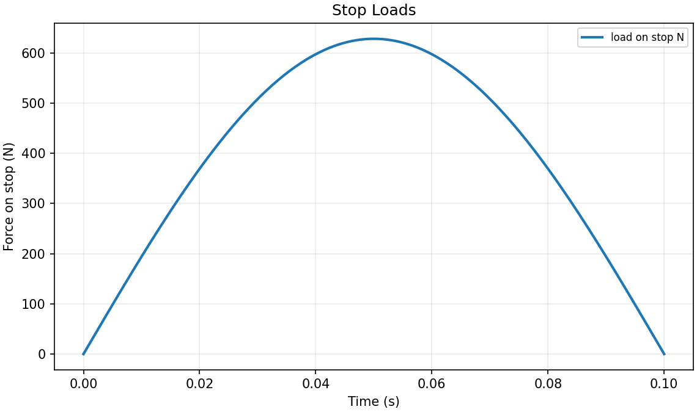
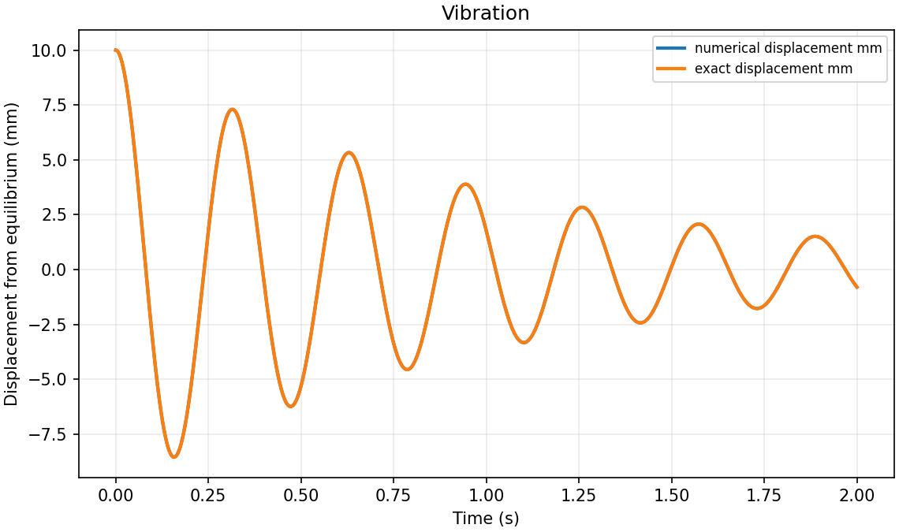

# Baseline plot gallery

Run `python3 run_all.py --plot` to reproduce the response plots.
See the [free-body diagrams](free-body-diagrams.md) for model geometry and forces.

## Beam bending moment

The point load creates a slope change; the distributed load produces curvature in the moment diagram.

## Dynamic and quasi-static actuator force

The difference depends on angular acceleration and moment arm. Slowing the same motion reduces the inertial force increment.

## Stopping-force pulse

The assumed half-sine pulse has a larger peak than its average force.

## Damped free vibration

The numerical and exact curves closely overlap. Read the reported numerical error to see their small difference.
